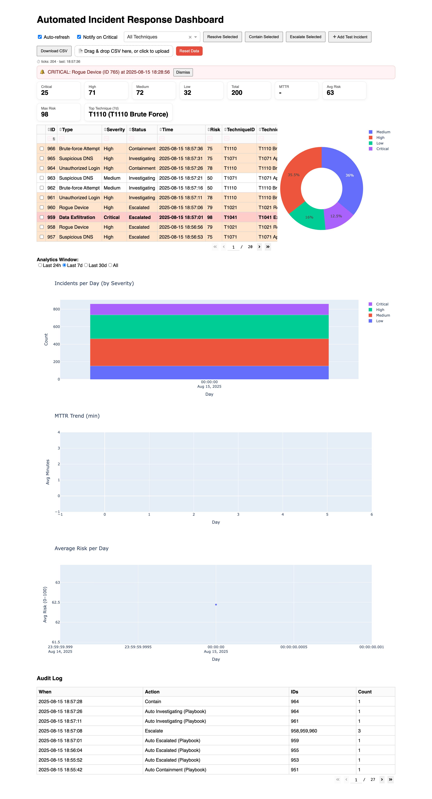

# Automated Incident Response Dashboard (AIRD)
<p align="center">
  <a href="https://www.python.org/"></a>
  <a href="https://dash.plotly.com/"></a>
  <a href="https://plotly.com/python/"></a>
  <a href="https://www.sqlite.org/"></a>
  <a href="#-mitre-attck-integration"></a>
  <a href="#-configuration"></a>
  <a href="LICENSE"></a>
  <br>
  <a href="https://github.com/NiassMayor/automated-incident-response-dashboard/stargazers"></a>
  <a href="https://github.com/NiassMayor/automated-incident-response-dashboard/network/members"></a>
</p> 



A **production-style SOC dashboard** built with [Dash](https://dash.plotly.com/) and [Plotly], simulating how real-world Security Operations Centers (SOCs) monitor, triage, and respond to incidents in real time.  

This project bridges the gap between *demo apps* and *true analyst workflows* by combining **automation, analytics, and MITRE ATT&CK alignment** in a single platform.  

---

##  Why This Project Matters

Modern SOCs are drowning in alerts — phishing, malware, brute-force, exfiltration attempts.  
Hiring managers want analysts who not only **understand incidents** but can also **build tools that reduce response time, visualize risk, and align with frameworks**.

This dashboard demonstrates:
- SOC-ready workflows (resolve, contain, escalate, notify, audit trails).
- Real-time alert simulation (auto-refresh with incident feed).
- Industry alignment (MITRE ATT&CK tactics + techniques).
- Team enablement (CSV import/export, audit logs, SLA tracking, notes, playbooks).
- Automation (Slack alerts for critical incidents, rule-based playbooks).  
- Business value (KPIs, risk scoring, MTTR tracking, historical trends).

It’s not just a coding project. It’s a **SOC analyst’s companion**.

---

##  Key Features

### Real-time Incident Feed
- Auto-refresh every 5 seconds with **new simulated alerts**.  
- Incidents classified by severity: Low, Medium, High, Critical.  
- Includes timestamp, status, and type (Phishing, Malware, Unauthorized Login, etc.).

### Response Actions
- **Resolve** – mark selected incidents as resolved.  
- **Contain** – mark and isolate threats for containment.  
- **Escalate** – hand off incidents to Tier 2 / management.  
- **Acknowledge** – assign owner + timestamp SLA compliance.  
- **Add Notes** – analysts add contextual notes to any incident.  

### CSV Import & Export
- Import incidents from any CSV (with flexible schema normalization).  
- Export the filtered/sorted view of incidents at any time.

### SOC KPIs
- Severity distribution pills (Critical, High, Medium, Low, Total).  
- **MTTR (Mean Time To Resolve)** auto-calculated.  
- **Open vs Resolved trend** chart.  
- **Risk score** showing the overall SOC risk level.

### MITRE ATT&CK  
> Incidents are mapped to tactics & techniques for faster triage, playbook automation, and framework-aligned reporting.
The dashboard embeds **MITRE ATT&CK mappings** into every incident workflow.

- Each alert can be tagged with:
  - **Tactics** (e.g., `TA0001 - Initial Access`, `TA0002 - Execution`).  
  - **Techniques** (e.g., `T1566 - Phishing`, `T1059 - Command Execution`).  
- Mappings are stored alongside incidents for **auditability and reporting**.  
- Enables:
  -  **Framework alignment** – incidents classified with ATT&CK.  
  -  **Faster triage** – understand attacker’s stage in the kill chain.  
  -  **Knowledge transfer** – handovers + reporting are standardized.  
  -  **Playbook automation** – trigger contain/escalate/notify workflows automatically based on mapped technique.

**Example**  
A `Phishing Email (T1566)` maps to `TA0001 - Initial Access` and immediately:  
- Sends a Slack notification to the SOC channel.  
- Starts the containment playbook (block sender, reset password).  

###  Playbook Automation
- Simple rule-based engine for auto-response.  
- Example:  
  - **Critical + MITRE T1566 (Phishing)** → Auto-notify via Slack + mark for containment.  
  - **Data Exfiltration** → Escalate + log audit trail.

###  Audit Log
- Every action (Resolve, Contain, Escalate, Add Note) logged with:  
  - Incident ID  
  - Action taken  
  - Actor (user / system)  
  - Timestamp  
- Displays as a table beneath analytics for transparency.  

###  Analytics
- **Severity distribution** pie chart.  
- **MTTR over time** line chart.  
- **Risk score trend** bar chart.  
- **Historical open/resolved** timeline.  

### Notifications
- Slack webhook integration for **Critical incidents**.  
- Sends a structured alert to a configured Slack channel.
    

## Screenshots
For a full walkthrough of the dashboard UI, see the PDF below:
 [View Dashboard Screenshots](screenshot/AIRD_Dashboard.pdf)

---

##  Tech Stack

- **Frontend/UI**: [Dash](https://dash.plotly.com/) (Plotly + React components)
- **Backend**: Python 3.9, Flask (via Dash)
- **Database**: SQLite (persistent storage for incidents, audit log, metrics)
- **Notifications**: Slack webhook integration
- **Deployment**: Works locally; container-ready with Docker

---

##  Getting Started

### 1. Clone & Setup
```bash
git clone https://github.com/NiassMayor/automated-incident-response-dashboard.git
cd automated-incident-response-dashboard
python3 -m venv venv
# Mac: source venv/bin/activate   # Windows: venv\Scripts\activate
pip install -r requirements.txt

## Run the App
python src/app.py

 Configuration

Slack Notifications

Set a Slack Incoming Webhook URL in your environment: export SLACK_WEBHOOK_URL="https://hooks.slack.com/services/XXXX/XXXX/XXXX"

 License

MIT License – free to use, modify, and learn from.

